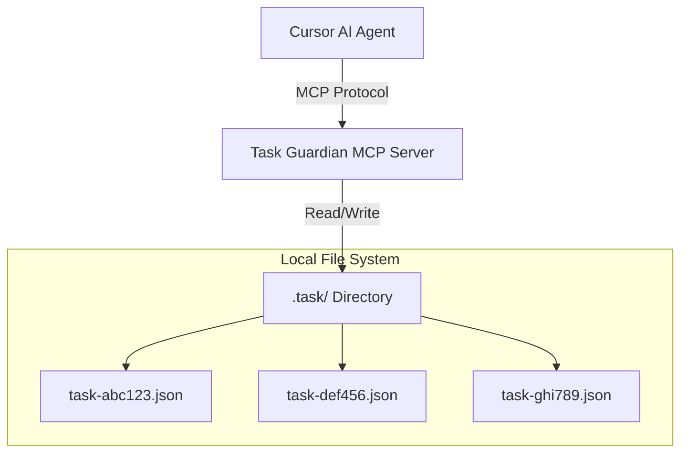
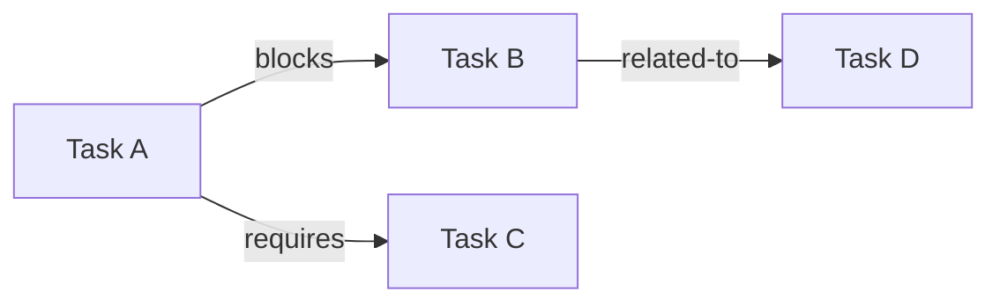

# 001-ADR: Task Guardian MCP Initial Architecture

**Date:** 2025-12-25
**Status:** Proposed
**Author:**

---

## Context

AI-powered development environments like Cursor are becoming increasingly sophisticated, with agents capable of executing complex coding tasks autonomously. However, task management in these environments remains ad-hoc, with agents lacking a standardized way to:

1. **Persist task state** across sessions
2. **Track dependencies** between related tasks
3. **Query and filter** tasks based on status, priority, or relationships
4. **Provide rich context** to guide implementation decisions

Current approaches rely on informal TODO comments, markdown checklists, or external project management tools that aren't integrated with the agent's workflow. This creates friction and reduces the effectiveness of agentic coding modes like Cursor's Plan Mode.

Task Guardian MCP addresses this gap by providing a **Model Context Protocol (MCP) server** that exposes task management primitives directly to the AI agent, enabling seamless task orchestration within the development environment.

---

## Goals

1. **Transparent Task Storage**: Store tasks as human-readable JSON files that integrate naturally with version control
2. **Rich Contextual Descriptions**: Support markdown-formatted task descriptions with code blocks, checklists, and structured content
3. **Typed Dependency Management**: Model relationships between tasks (blocking, required, related) to enable intelligent task ordering
4. **Agent-Friendly API**: Expose MCP tools that allow agents to create, read, update, delete, and query tasks
5. **Cursor Integration**: Provide seamless integration with Cursor's Plan Mode and other AI-assisted workflows
6. **Minimal Overhead**: Keep the system simple, with no database setup or external services required

## Non-Goals

1. **Visual UI**: No web interface or GUI (tasks managed through MCP tools only)
2. **Real-time Collaboration**: No multi-user or concurrent editing support
3. **Time Tracking**: No built-in time tracking or effort estimation
4. **Notifications**: No email/Slack/webhook integrations
5. **Cloud Sync**: No built-in synchronization across machines (rely on git)
6. **Complex Workflows**: No state machines, approval flows, or business process management

---

## Decision

### Architecture Overview

Task Guardian MCP follows a **file-based, document-oriented** architecture where each task is stored as an individual JSON file in a `.task/` directory within the project workspace.



### Task Schema

Each task file follows a standard JSON schema with the following fields:

| Field | Type | Required | Description |
|-------|------|----------|-------------|
| `id` | string | ✓ | Unique identifier (e.g., `task-abc123`) |
| `title` | string | ✓ | Short, descriptive task title |
| `description` | string | ✓ | Markdown-formatted detailed description |
| `status` | enum | ✓ | Current state: `pending`, `in_progress`, `completed`, `blocked`, `cancelled` |
| `priority` | enum | ✓ | Importance: `low`, `medium`, `high`, `critical` |
| `dependencies` | array | ✓ | Array of dependency objects (can be empty) |
| `createdAt` | ISO8601 | ✓ | Task creation timestamp |
| `updatedAt` | ISO8601 | ✓ | Last modification timestamp |

#### Example Task with Rich Markdown Description

```json
{
  "id": "task-auth-001",
  "title": "Implement OAuth2 authentication flow",
  "description": "## Overview\n\nAdd OAuth2 authentication using Google as the identity provider.\n\n## Acceptance Criteria\n\n- [ ] User can initiate login with Google button\n- [ ] OAuth2 authorization code flow completes successfully\n- [ ] JWT tokens are generated and stored securely\n- [ ] Token refresh mechanism works correctly\n- [ ] Error handling for failed auth attempts\n\n## Implementation Notes\n\n```typescript\n// Use passport.js with Google OAuth2 strategy\nimport passport from 'passport';\nimport { Strategy as GoogleStrategy } from 'passport-google-oauth20';\n\npassport.use(new GoogleStrategy({\n  clientID: process.env.GOOGLE_CLIENT_ID,\n  clientSecret: process.env.GOOGLE_CLIENT_SECRET,\n  callbackURL: '/auth/google/callback'\n}, verifyCallback));\n```\n\n## Related Files\n\n- `src/auth/oauth.ts` - OAuth configuration\n- `src/middleware/auth.ts` - Auth middleware\n- `src/routes/auth.ts` - Auth routes\n\n## External Resources\n\n- [Passport.js Google OAuth2](https://www.passportjs.org/packages/passport-google-oauth20/)\n- [OAuth2 RFC 6749](https://datatracker.ietf.org/doc/html/rfc6749)",
  "status": "pending",
  "priority": "high",
  "dependencies": [
    {
      "taskId": "task-setup-001",
      "type": "blocks",
      "description": "Database schema setup must complete first"
    }
  ],
  "createdAt": "2025-12-25T10:00:00Z",
  "updatedAt": "2025-12-25T10:00:00Z"
}
```

### Markdown Description Structure

The `description` field supports **full markdown syntax**, enabling rich, structured content that provides maximum context to the LLM:

**Recommended Sections:**
- **Overview**: High-level explanation of what needs to be done
- **Acceptance Criteria**: Checklist format for clear success metrics
- **Implementation Notes**: Code snippets, architectural guidance, API examples
- **Related Files**: List of files that will be modified
- **External Resources**: Links to documentation, RFCs, examples

**Benefits for LLM Consumption:**
1. **Structured headings** help the LLM navigate to relevant sections
2. **Code blocks** provide implementation templates and examples
3. **Checklists** enable the LLM to track sub-task completion
4. **Links** allow the LLM to reference external context (if supported)
5. **Tables** organize complex data specifications clearly

### Typed Dependency Model

Dependencies between tasks are modeled as typed relationships, allowing for nuanced dependency management:



#### Dependency Types

| Type | Behavior | Use Case |
|------|----------|----------|
| `blocks` | Hard dependency - dependent task cannot start until this completes | Critical prerequisite (e.g., setup before implementation) |
| `requires` | Soft dependency - dependent task can proceed with warning | Recommended prerequisite (e.g., design before coding) |
| `related-to` | Informational link - no enforcement | Context/reference (e.g., similar tasks, related features) |

#### Dependency Object Schema

```json
{
  "taskId": "task-xyz-789",
  "type": "blocks",
  "description": "Optional human-readable explanation of the dependency"
}
```

### MCP Tools Interface

Task Guardian exposes **8 core MCP tools** that enable comprehensive task management:

#### 1. `create_task`

Creates a new task with full validation.

**Input Schema:**
```typescript
{
  title: string;
  description: string;
  status?: "pending" | "in_progress" | "completed" | "blocked" | "cancelled";
  priority?: "low" | "medium" | "high" | "critical";
  dependencies?: Array<{
    taskId: string;
    type: "blocks" | "requires" | "related-to";
    description?: string;
  }>;
}
```

**Output:**
```typescript
{
  success: boolean;
  taskId: string;
  message: string;
}
```

#### 2. `get_task`

Retrieves a single task by ID.

**Input Schema:**
```typescript
{
  taskId: string;
}
```

**Output:**
```typescript
{
  success: boolean;
  task: TaskObject | null;
}
```

#### 3. `update_task`

Partially updates task fields.

**Input Schema:**
```typescript
{
  taskId: string;
  updates: {
    title?: string;
    description?: string;
    status?: "pending" | "in_progress" | "completed" | "blocked" | "cancelled";
    priority?: "low" | "medium" | "high" | "critical";
  };
}
```

**Output:**
```typescript
{
  success: boolean;
  message: string;
}
```

#### 4. `delete_task`

Deletes a task with dependency validation.

**Input Schema:**
```typescript
{
  taskId: string;
  force?: boolean; // Skip dependency check if true
}
```

**Output:**
```typescript
{
  success: boolean;
  message: string;
  warnings?: string[]; // If other tasks depend on this
}
```

#### 5. `list_tasks`

Lists all tasks with optional filtering.

**Input Schema:**
```typescript
{
  status?: "pending" | "in_progress" | "completed" | "blocked" | "cancelled";
  priority?: "low" | "medium" | "high" | "critical";
  limit?: number;
  offset?: number;
}
```

**Output:**
```typescript
{
  success: boolean;
  tasks: TaskObject[];
  total: number;
}
```

#### 6. `add_dependency`

Adds a typed dependency between tasks.

**Input Schema:**
```typescript
{
  fromTaskId: string; // The task that depends
  toTaskId: string;   // The task being depended upon
  type: "blocks" | "requires" | "related-to";
  description?: string;
}
```

**Output:**
```typescript
{
  success: boolean;
  message: string;
}
```

#### 7. `remove_dependency`

Removes a dependency link.

**Input Schema:**
```typescript
{
  fromTaskId: string;
  toTaskId: string;
}
```

**Output:**
```typescript
{
  success: boolean;
  message: string;
}
```

#### 8. `query_tasks`

Advanced task search and filtering.

**Input Schema:**
```typescript
{
  filters?: {
    status?: string[];
    priority?: string[];
    hasDependencies?: boolean;
    titleContains?: string;
    descriptionContains?: string;
  };
  sort?: {
    field: "createdAt" | "updatedAt" | "priority" | "title";
    order: "asc" | "desc";
  };
  limit?: number;
  offset?: number;
}
```

**Output:**
```typescript
{
  success: boolean;
  tasks: TaskObject[];
  total: number;
}
```

### Technology Stack

| Component | Technology | Rationale |
|-----------|-----------|-----------|
| **Runtime** | Bun | Project standard, fast startup, built-in TypeScript support |
| **MCP SDK** | `@modelcontextprotocol/sdk` | Official TypeScript SDK for MCP protocol |
| **Validation** | Zod | Type-safe schema validation, already installed |
| **Transport** | Stdio | Standard for local MCP servers, Cursor-compatible |
| **File I/O** | `Bun.file()` | Native Bun API for fast, async file operations |

### File Structure

```
task-guardian-mcp/
├── src/
│   ├── index.ts              # MCP server entry point
│   ├── schemas/
│   │   ├── task.schema.ts    # Zod schemas for task validation
│   │   └── tool.schema.ts    # Zod schemas for tool inputs
│   ├── services/
│   │   ├── task.service.ts   # Core task CRUD operations
│   │   └── dependency.service.ts # Dependency management logic
│   └── tools/
│       ├── create-task.ts
│       ├── get-task.ts
│       ├── update-task.ts
│       ├── delete-task.ts
│       ├── list-tasks.ts
│       ├── add-dependency.ts
│       ├── remove-dependency.ts
│       └── query-tasks.ts
├── .task/                    # Client project's task directory (not in repo)
│   ├── task-abc123.json
│   └── task-def456.json
├── package.json
└── README.md
```

---

## Consequences

### Positive

1. **Zero Setup Overhead**: No database installation, migrations, or configuration required
2. **Version Control Friendly**: JSON files integrate naturally with git, enabling task history tracking
3. **Human Readable**: Tasks can be inspected, edited, and understood without special tools
4. **Agent-Optimized**: Rich markdown descriptions provide maximum context for LLM decision-making
5. **Cursor Integration**: Direct MCP protocol support enables seamless Plan Mode integration
6. **Type Safety**: Zod schemas ensure data integrity and provide clear error messages
7. **Portable**: Tasks are just files - easy to backup, migrate, or share
8. **Transparent**: Agent's task operations are visible and auditable

### Negative

1. **File System Performance**: Large numbers of tasks (>1000) may experience slower operations
2. **No Concurrent Editing**: Multiple agents/users editing simultaneously could cause conflicts
3. **Limited Query Performance**: Complex filtering requires scanning all task files
4. **No Built-in Locking**: Race conditions possible if multiple processes write simultaneously
5. **Manual Schema Evolution**: Updating task schema requires migration scripts

### Mitigations

1. **Performance**:
   - Implement in-memory task cache with file watcher for invalidation
   - Add indexing for common queries (status, priority)
   - Document recommended task lifecycle (archive completed tasks)

2. **Concurrency**:
   - Use atomic file operations (`Bun.write()` is atomic on most filesystems)
   - Add optimistic locking with `updatedAt` timestamp checks
   - Document single-agent usage recommendation

3. **Query Performance**:
   - Consider optional SQLite index file for large projects (future enhancement)
   - Implement pagination to limit result sets
   - Cache frequently accessed task lists

4. **Schema Evolution**:
   - Version task schema (`"schemaVersion": "1.0"`)
   - Provide migration utilities for breaking changes
   - Maintain backward compatibility where possible

---

## Alternatives Considered

### 1. SQLite Database

Store tasks in a local SQLite database instead of individual JSON files.

**Pros:**
- Fast queries and filtering
- ACID transactions
- Powerful relational queries
- Built-in indexing

**Cons:**
- Binary format not human-readable
- Harder to version control
- Requires database setup/initialization
- More complex backup/restore
- Less transparent to users

**Decision:** Rejected. The file-based approach better aligns with version control workflows and provides transparency that's valuable in development environments.

### 2. Single JSON File (tasks.json)

Store all tasks in a single JSON file.

**Pros:**
- Simpler to implement
- Single file to track in git
- Atomic reads/writes
- Easy to query (load once)

**Cons:**
- Merge conflicts on concurrent edits
- Large file size as tasks grow
- Must load/parse entire file for single task
- Harder to diff in version control

**Decision:** Rejected. Individual files provide better scalability and reduce merge conflicts.

### 3. YAML Format

Use YAML instead of JSON for task files.

**Pros:**
- More human-readable
- Supports comments
- Multiline strings easier
- Less punctuation noise

**Cons:**
- Slower parsing
- More ambiguous (indentation-sensitive)
- Less tooling support
- Potential for parsing errors

**Decision:** Rejected. JSON provides better TypeScript integration, faster parsing, and universal tooling support.

### 4. External Task Management API

Integrate with existing tools like Jira, Linear, or GitHub Issues.

**Pros:**
- Professional task management features
- Team collaboration built-in
- Rich query capabilities
- Mobile/web access

**Cons:**
- Requires authentication setup
- Network dependency
- API rate limits
- Complexity overhead
- Vendor lock-in

**Decision:** Rejected. The goal is a lightweight, local-first solution for agent-driven development.

---

## Open Questions

1. **Task Archiving Strategy**: Should completed tasks be automatically moved to an `.task/archive/` directory after a certain time period?
Yes, that would help clean up the task list but still keep the history.

2. **Dependency Cycle Detection**: Should the system prevent circular dependencies at creation time, or allow them with runtime warnings?
Prevent them at creation time.

3. **Task Templates**: Should we support task templates (e.g., "Bug Fix" template with predefined sections)?
Not at this moment.

4. **Subtask Support**: Should tasks support hierarchical subtasks, or should subtasks be modeled as separate tasks with `blocks` dependencies?
We should support ticket based system, like User Story, Task, Bug, etc.

5. **Task IDs**: Should IDs be human-readable slugs (`task-implement-auth`) or random identifiers (`task-a7f3c2b1`)?
Ids should be number incremented by 1.

6. **Metadata Extension**: Should tasks support custom metadata fields for project-specific attributes?
Yes, as some project may need to store additional attributes.

7. **Validation Strictness**: Should unknown fields in task JSON be rejected (strict) or preserved (permissive)?
Permissive as they would be used for the project specific attributes.

8. **Batch Operations**: Should we add bulk operations (`create_tasks`, `update_tasks`) for efficiency?
Yes, as it would be more efficient.
---

## References

- [Model Context Protocol Specification](https://modelcontextprotocol.io/specification)
- [MCP TypeScript SDK Documentation](https://github.com/modelcontextprotocol/typescript-sdk)
- [Cursor Documentation - Plan Mode](https://cursor.sh/docs)
- [Zod Schema Validation](https://zod.dev/)
- [Bun File I/O APIs](https://bun.sh/docs/api/file-io)

